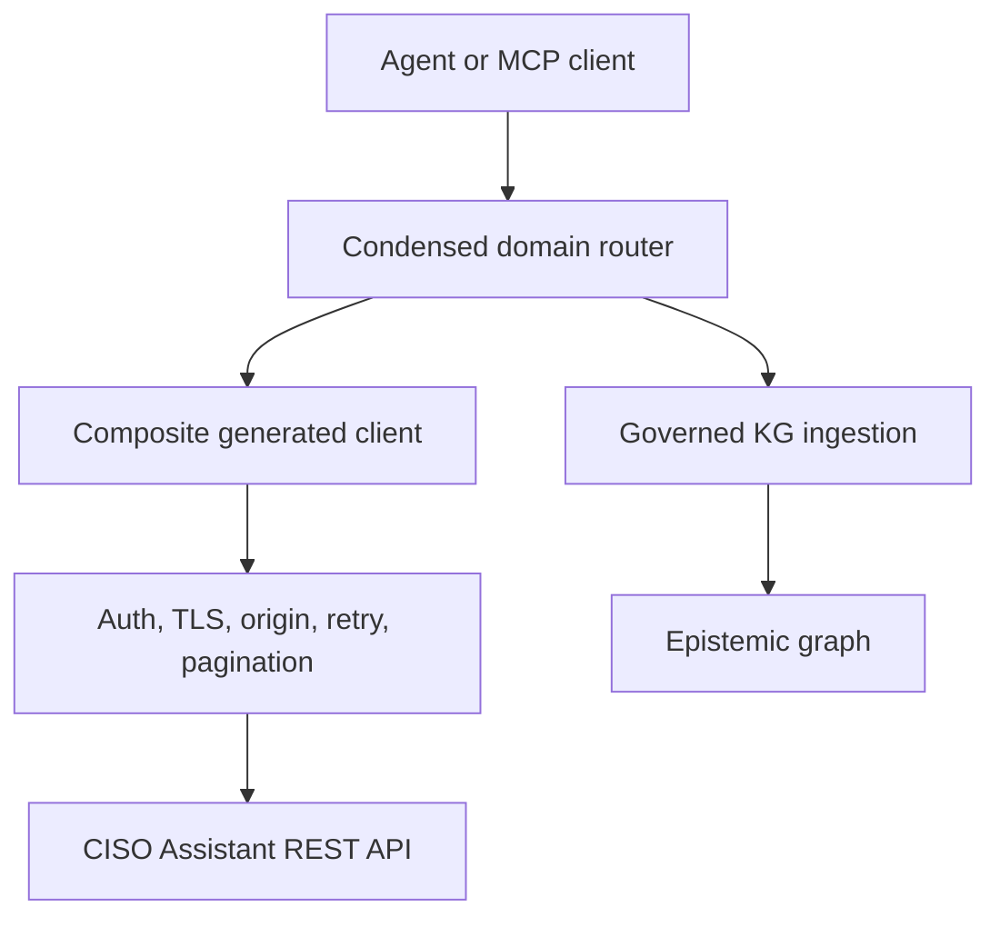

# Overview

`ciso-assistant-api` exposes the CISO Assistant public REST API as a composite
Python client, an action-routed MCP server, and an optional A2A agent.

## Generated API and MCP surface

The vendored OpenAPI document is the source for approximately 1,565 operations
across 19 domains. `scripts/generate_from_openapi.py` emits:

- one generated client mixin per domain;
- the operation manifest used for coverage checks;
- one condensed action router per domain and an optional verbose tool per
  operation;
- the README tool inventory.

Generated clients, operation manifests, and MCP modules must be regenerated
together. The hand-authored base client owns authentication, mandatory TLS,
same-origin URL enforcement, pagination, retries, and response decoding.

## Product areas

| Area | MCP domains |
| --- | --- |
| Governance and compliance | `governance`, `compliance`, `frameworks_libraries` |
| Risk and resilience | `risk_management`, `ebios_rm`, `crq`, `resilience` |
| Incidents and evidence | `incidents`, `evidence`, `security_findings` |
| Assets and third parties | `assets`, `third_party` |
| Privacy | `privacy` |
| Platform operations | `auth_users`, `analytics_metrology`, `chat`, `integrations`, `settings`, `tasks_timeline` |

`MCP_TOOL_MODE=condensed` is the intended delegated surface. Operator policy can
disable individual domains and should expose the arbitrary-request tool only
when its expanded access is explicitly required.

## Provider contributions

The package publishes discovery entry points for its canonical operations skill,
ontology source, prompt assets, and connector source presets. These are inputs to
the wider Agent OS ecosystem; signed schema-v2 capability evidence is generated
and validated centrally rather than hand-authored here.

See [Configuration](configuration.md) for the runtime trust and privacy contract.
